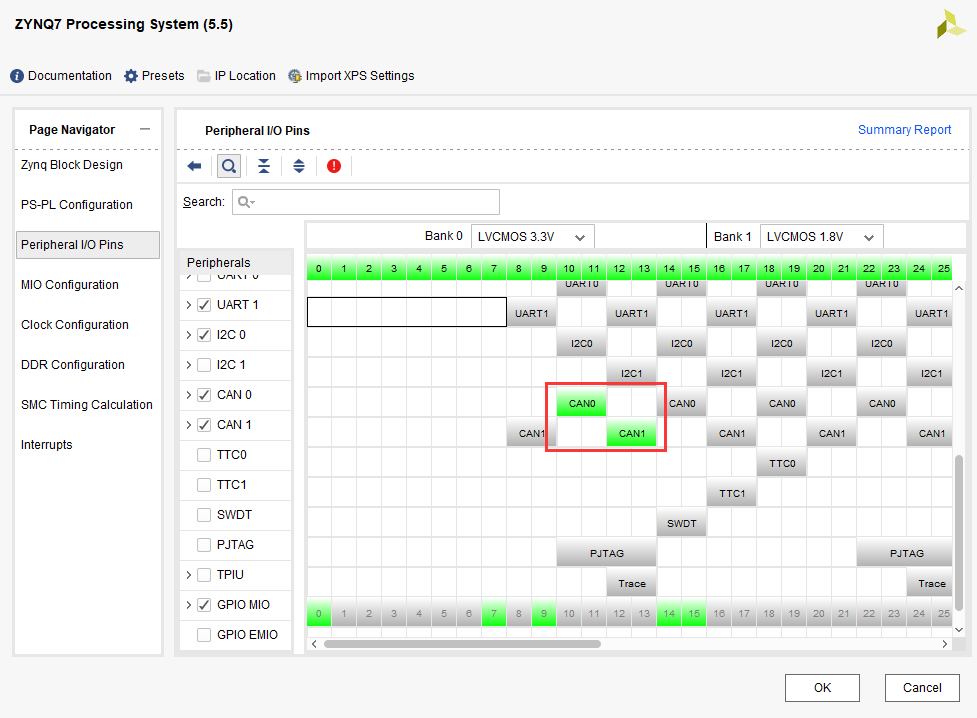
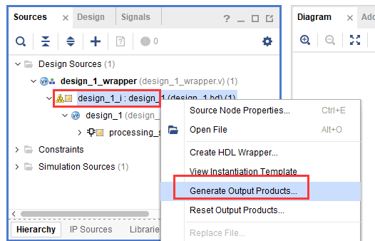
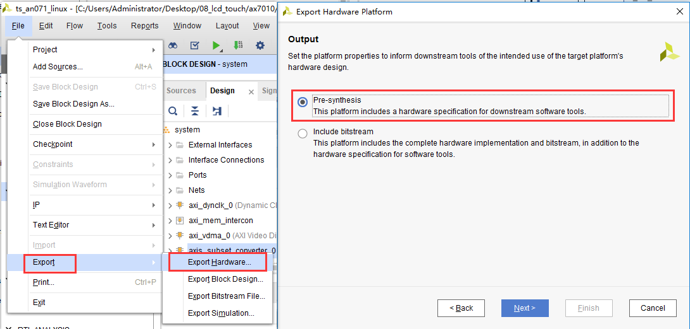
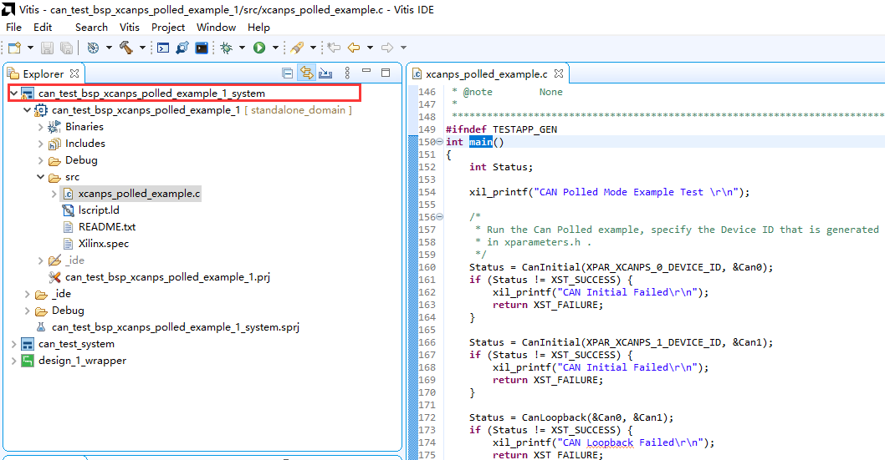
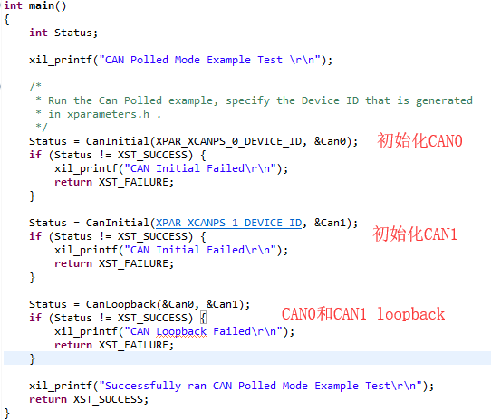
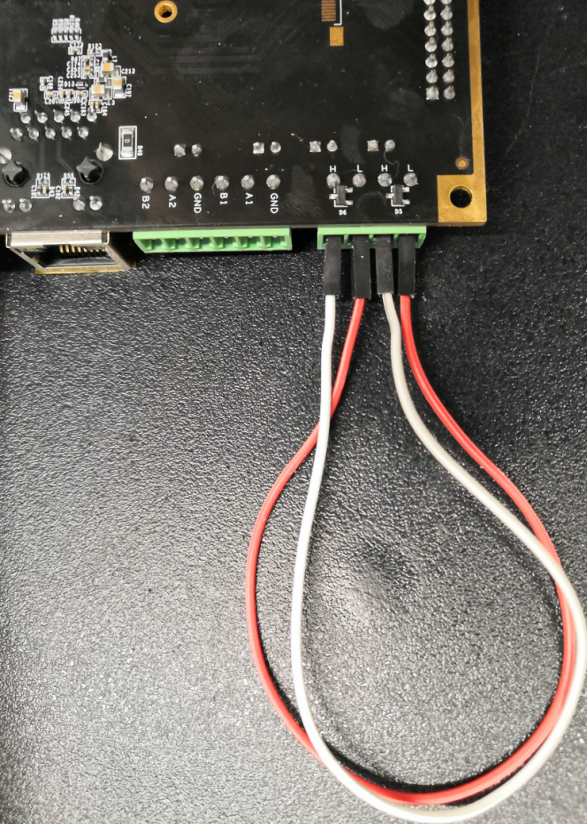
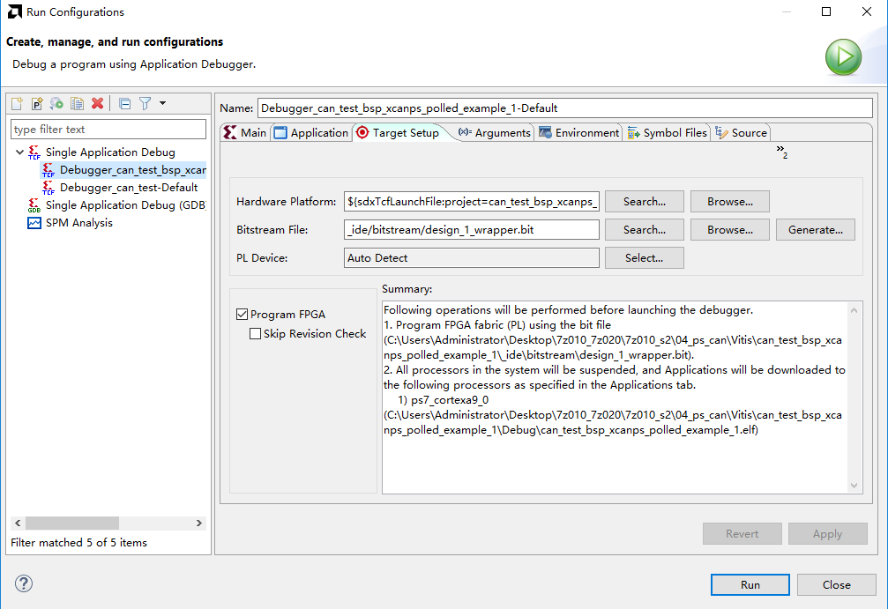
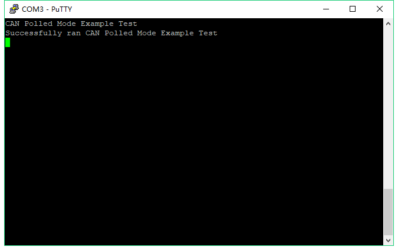

CAN总线读写
=============

本章介绍利用板子上了两路CAN接口进行回环测试。

硬件环境搭建
------------

基于”ps_hello”工程另存为一份ps_can，打开block
design，配置ZYNQ核，选择CAN0和CAN1，点击OK即可。

保存设计，Generate Output Products

重新导出硬件信息，不包含bitstream

Vitis程序开发
-------------

在Vitis软件中新建工程can_test，并引入example工程，xcanps_polled_example，此example工程是测试单个CAN接口的内部loopback，本实验是在此example基础上进行的修改，将两个CAN接口都设置为Normal
Mode，并在外部连接起来，进行loopback测试。

1. 功能其实也比较简单，主要就是两路CAN的初始化，并设置为Normal
   Mode，然后是loopback。

2. CanLoopback函数也比较简单，先是CAN0发数据，CAN1接收数据并进行数据对比，然后清除RxBuffer的数据，再是CAN1发送数据，CAN0接收数据并进行数据对比，测试结束。

..

   .. image:: images/04_media/image6.png
      :width: 3.5941in
      :height: 3.45142in

下载测试
--------

1. 利用杜绑线将CAN0的H和L分别与CAN1的H和L进行连接

2. 下载程序

3. 在串口看到打印信息，大家也可以进入Debug模式进行数据的观测。

