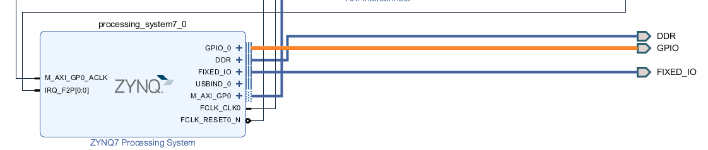
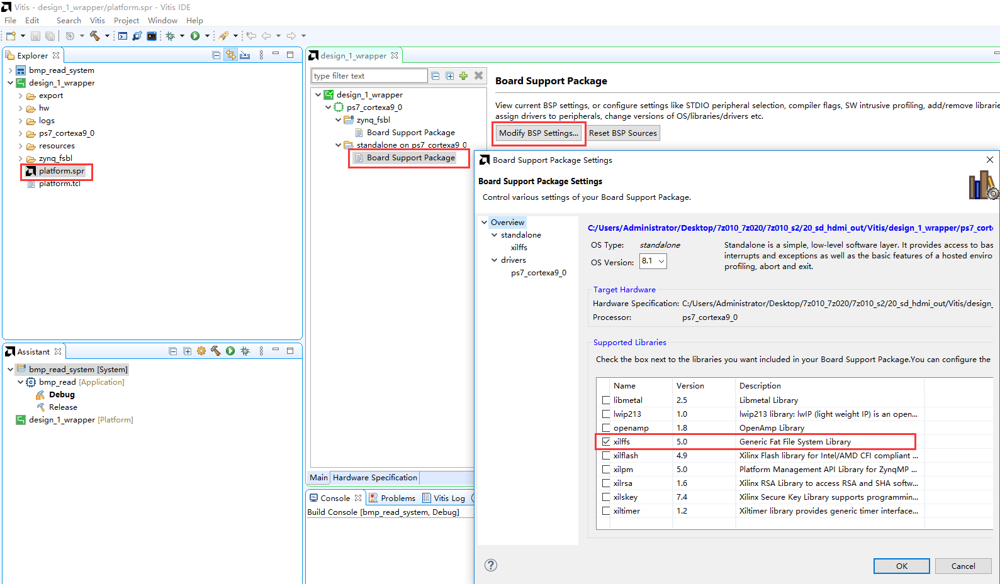

SD卡读写操作之摄像头抓拍
==========================

前面介绍了BMP图片的SD卡读写操作，但选择的是静态画面，本章结合OV5640摄像头模块，抓拍图像并保存到SD卡中。

硬件工程的建立
--------------

1. 基于ov5640摄像头的采集显示一实验，之前的VDMA单帧设置已不适用，为了实现抓拍功能，需要采用一幅完整的画面写到SD卡，在这里将axi_vdma_0和axi_vdma_1的Frame
   Buffers都设置为3，也就是3帧缓存，如此，在抓拍的时候不再进行帧的切换，将前面的完整一帧写入SD卡。3帧缓存也能解决单帧缓存显示图像割裂的问题。

.. image:: images/21_media/image2.png
   :width: 5.29366in
   :height: 3.92668in

2. AX7Z020和AX7Z010开发板需要导出两位的EMIO连接到PL端的按键和LED灯

3. 保存设计，重新生成bitstream，并导出硬件信息。

Vitis程序开发
-------------

本实验流程如下：

初始化VDMA三帧图像切换检测到抓拍按键中断，停止图像切换拷贝当前帧之前的帧图像数据到拍照缓存区继续三帧图像切换，同时写图像数据到SD卡

1. 在本实验中同样要打开xilffs库，如下图，在Board Support Package
   Settings里设置

2. 在工程中添加了bmp.c和bmp.h，也就是BMP图片显示一章中的BMP头信息和读写BMP函数。

3. 在display_demo.c文件的main函数中同时打开摄像头和显示VDMA的中断，并设置摄像头的中断服务函数为WriteCallBack，显示的中断服务函数为ReadCallBack。在WriteCallBack函数中，判断按键是否按下，再改变key_flag的值，此时不再进行读写帧的切换。

4. 在main函数的while循环，判断key_flag的值，将照片名称加1，将当前帧之前的有效帧copy到照片缓存区，之后清除key_flag，写BMP图像数据到SD卡，并打印出所需的时间值。

板上验证
--------

1. 连接开发板如下，将SD卡插入背面SD卡座，打开电源，打开putty。

AX7015硬件连接图

AX7021硬件连接图（J16扩展口）

.. image:: images/21_media/image10.png
   :width: 4.36386in
   :height: 5.04227in

AX7020/AX7010硬件连接图(J10扩展口)

.. image:: images/21_media/image11.png
   :width: 5.29654in
   :height: 3.0863in

AX7Z035/AX7Z100硬件连接图

AX7Z020/AX7Z010硬件连接图（扩展口J20）

2. 下载程序，图像显示后，按下按键，在写SD的时候PS端LED灯会亮，写完灭掉。（AX7015开发板为PS_KEY和PS_LED；AX7021开发板为KEY1和LED1；AX7020/AX7010开发板为PS
   KEY1和PS
   LED1；AX7Z035/AX7Z100开发板为KEY1和LED1；AX7Z020/AX7Z010为KEY1）

AX7015效果图

3. 在putty中，可以看到打印信息

.. image:: images/21_media/image14.png
   :width: 4.36385in
   :height: 2.74793in

4. 断电取出SD卡，在电脑上可以看到SD卡内抓拍的BMP图片

.. image:: images/21_media/image15.png
   :width: 4.77802in
   :height: 0.98877in
