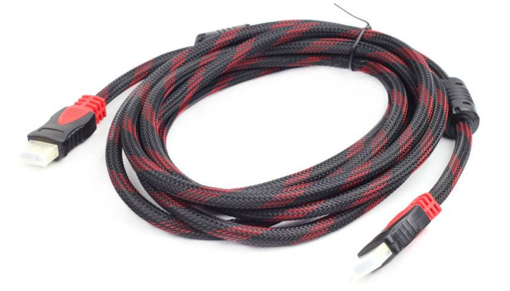
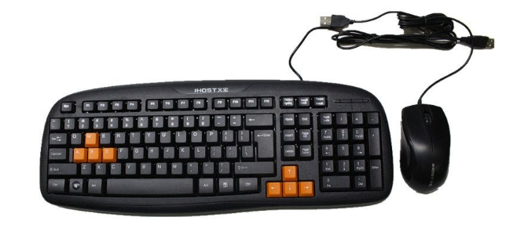
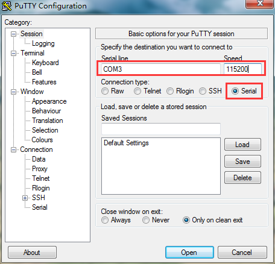

Package descriptions and development board testing
==================================================================

In order to make it easier for you to find the software used in the tutorials, source packages, drivers, etc., the following will introduce the main contents of the package, the tutorials inevitably have omissions, can not be found when the trouble is that you search your computer.

Package Description
------------------------------

.. image:: images/01_media/image1.png
      
1) CP210x_Windows_Drivers.zip Serial Driver

2) **Xilinx_Unified_2023.1_0507_1903.tar.gz** Vivado
   2023.1 installation package, Windows and Linux universal version, Windows need WinRAR decompression software.

3) petalinux-v2023.1-final-installer.run petalinux installation package

4) qt-opensource-windows-x86-mingw530-5.7.1.exe Windows version of QT

5) qt-opensource-linux-x64-5.7.1.run Linux version of QT

6) imageUSB.exe Image Recovery Tool

7) 00_resource contains Linux source code, root file system

8) VMware-workstation-full-12.1.1-3770994.exe Virtual Machine Installation Package

9) ubuntu-16.04.3-desktop-amd64.iso
   Ubuntu installer, only for PCs, not for development boards.

Development Board Testing
------------------------------

Getting the development board, most people want to experience it immediately to see if the development board is working properly, here we introduce how to do a simple test on the development board.

Measure the tools you need to bring with you
~~~~~~~~~~~~~~~~~~~~~~~~~~~~~~~~~~~~~~~~~~~~~~~~

1) Computer

.. image:: images/01_media/image2.png
      
2) Another HDMI-enabled monitor, the required resolution is not less than 1920x1080, the development board does not support no power HDMI to VGA converter, you need to use a separate power supply converter.

.. image:: images/01_media/image3.png
      
3) HDMI cable 1pc

      
4) USB mouse and keyboard

      
5) Router, in order to test the network, it is best to be able to connect to the Internet, support for DHCP, this is very important, especially for those who will not configure the network of developers, if it is a campus network, a special operator broadband, but also special routers.

.. image:: images/01_media/image6.png
      
6) Network cable

.. image:: images/01_media/image7.png
      
Board Cable Connection
~~~~~~~~~~~~~~~~~~~~~~~~~~~

1) Connecting an HDMI monitor

2) Connect the network port to the router

3) Connecting the power supply

.. image:: images/01_media/image8.png
      
start testing
~~~~~~~~~~~~~~~~~~~~

1) Before the test we need to install the USB to serial port driver software (Software/CP210x_Windows_Drivers.zip), otherwise you can not do serial communication test, double-click the exe file for driver installation. After the driver is installed, use the red USB cable to connect the USB port of the computer and the UART port (J7) on the development board to connect.
   Then open the computer's device manager, device manager to be able to find the serial port device CP210x, the
   I have COM3 mapped on my machine. if you can't install the driver successfully, try installing it using Driver Wizard.

.. image:: images/01_media/image9.png
      
.. image:: images/01_media/image10.png
      
.. image:: images/01_media/image11.png
      
2) There are a lot of terminal tools, such as putty, teraterm, and
   Windows comes with terminal tools, SecureCRT and so on, many terminal tools, compared down, or putty the best to use, the information (software /)
   (putty.exe) has prepared green no-installation putty software for everyone.

3) Select Serial, Serial
   line fill in COM3, Speed fill in 115200, COM3 serial port number according to the device manager display fill in the

      
Select Serial and change the Flow control to None and click "Open".

.. image:: images/01_media/image13.png
      
.. image:: images/01_media/image14.png
      
post-launch interface

4) Determine whether the boot mode of the development board is SD boot mode (by default, there is a card in the SD card slot of the development board when it is shipped from the factory, and the boot mode is also SD card by default), and modify the boot mode by jumping the bubble.

.. image:: images/01_media/image15.png
      
5) Turn on the power switch on the development board, the PuTTY tool window will display u-boot and Linux system boot information.

.. image:: images/01_media/image16.png
      
6) You can log in to the system from the serial terminal, user: root, password: root.

There are a lot of people who are new to Putty, or using the serial port for the first time. It should be noted that Putty input commands are entered through the host keyboard, not through the keyboard attached to the development board

.. image:: images/01_media/image17.png
      
7) After the startup is complete, connect the development board HDMI monitor will show the Debian desktop. May be prompted to select the panel, select the default panel configuration can be.

.. image:: images/01_media/image18.png
      
.. image:: images/01_media/image19.png
      
8) This time you can use the connection to the mouse and keyboard to operate, double-click the Web browser with the mouse, start the browser longer, please be patient.

.. image:: images/01_media/image20.png
      
9) Enter the URL in the address bar, here we enter the URL of Black Gold Power Community. Open it normally, our development board has been able to access the Internet normally. Tip, do not use the browser with the search function, because the country can not use Google search. \ **Here it should be noted: some companies, school networks have network control, not any device can be connected to the Internet, it is recommended to consult the network administrator**\ .

.. image:: images/01_media/image21.png
      
10) This concludes the simple testing of the development board.

*ZYNQ-7000 Development platform FPGA tutorial*    - `Alinx official website <http://www.alinx.com>`_